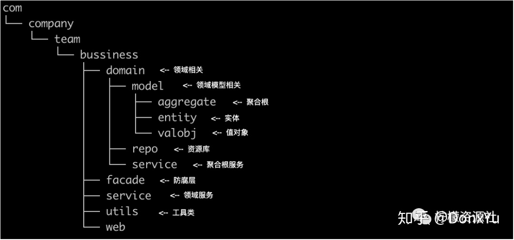
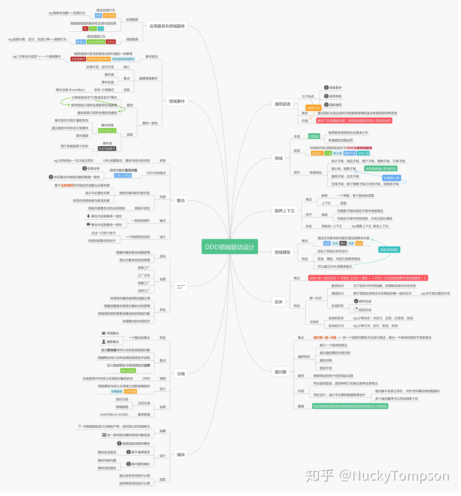

# demo示例功能

## DDD领域模型架构

### 架构图

1. 结构架构图

2. 模块架构图

### 初步规划简单功能

* 包括买方（demo-web-purchaser），销售供应商(demo-web-vendor)，厂家(demo-web-manufacturers)三个服务
* 上层web层仅做简单区分，设计RPC接口进行调用
* 下层以package的方式，区分不同服务的依赖使用
